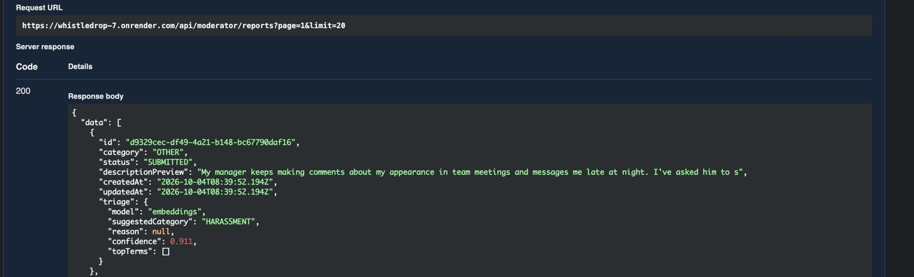

# WhistleDrop

WhistleDrop is the backend for a confidential reporting system. Anyone can report a problem inside an organization without creating an account or revealing who they are.

I picked WhistleDrop because of one odd requirement: the system has to act on reports without knowing who sent them. Most backends I've worked on collect as much as they can about users, so building one that collects as little as possible was a different way of thinking.

A reporter sends a category, a description and an optional evidence link, with no account. They get back a random case code, and that code is the only thing linking them to their report. Moderators log in, review reports and update the status, and every update message is shown to the reporter. I wanted the privacy part to be enforced by the code and checked by tests, not just promised in this README.

Even rate limiting needed thought: it has to recognise repeat clients without storing anything about them, so the counters live in memory only. There's no frontend, so I documented the API with Swagger at `/docs`.

## Contents

- [Setup](#setup)
- [API endpoints](#api-endpoints)
- [How anonymity is maintained](#how-anonymity-is-maintained)
- [Example requests and responses](#example-requests-and-responses)
- [AI features](#ai-features)
- [Design decisions and assumptions](#design-decisions-and-assumptions)
- [Testing](#testing)
- [Screenshots](#screenshots)
- [Deployment](#deployment)
- [Future work](#future-work)

## Setup

Requirements: Node.js v26.7.0 or newer, and npm.

```bash
git clone https://github.com/SouryaneelPal/whistledrop.git
cd whistledrop
npm install
cp .env.example .env
```

Open `.env` and set:

- `JWT_SECRET` to a long random string, for example the output of `openssl rand -hex 32`
- `SEED_MODERATOR_USERNAME` and `SEED_MODERATOR_PASSWORD` (at least 12 characters) for the first moderator

Then create the database, create the moderator and start the server:

```bash
npm run db:push
npm run seed
npm run dev
```

The API runs on `http://localhost:4000` and the interactive docs on `http://localhost:4000/docs`.

### Environment variables

| Variable | Purpose | Default |
|---|---|---|
| `DATABASE_URL` | SQLite database file | `file:./dev.db` |
| `JWT_SECRET` | Signs moderator tokens (at least 16 characters; `change-me...` is refused in production) | required |
| `JWT_EXPIRES_IN` | Token lifetime, in seconds or with s, m, h, d (for example `1h`) | `1h` |
| `PORT` | Server port | `4000` |
| `NODE_ENV` | `development`, `test` or `production` | `development` |
| `SUBMIT_LIMIT_PER_HOUR` | Report submissions allowed per client per hour | `30` |
| `TRACK_LIMIT_PER_15_MIN` | Status lookups allowed per client per 15 minutes | `30` |
| `TRUST_PROXY` | Number of proxies in front of the app, `0` means none | `0` |
| `SEED_MODERATOR_USERNAME` | Username of the moderator created by the seed | none |
| `SEED_MODERATOR_PASSWORD` | Password for that moderator | none |
| `ML_EMBEDDINGS` | `on` uses the embedding model for triage, `off` forces the TF-IDF model | `on` |
| `TRIAGE_BUDGET_MS` | Time limit per moderator request for embedding; reports after it use TF-IDF | `1500` |

### Scripts

| Command | What it does |
|---|---|
| `npm run dev` | Starts the server with automatic reload |
| `npm run build` | Compiles TypeScript into `dist/`, copies the OpenAPI file and downloads the embedding model into `.models/` |
| `npm start` | Runs the compiled server |
| `npm test` | Runs the full test suite |
| `npm run seed` | Creates the first moderator from the environment variables (leaves an existing one unchanged) |
| `npm run db:push` | Creates or updates the database tables |
| `npm run ml:embed` | Embeds `ml/dataset.csv` with the server's embedding model, for training |
| `npm run ml:memcheck` | Builds and starts the production server, then reports its memory use and triage speed |

## API endpoints

| Method | Path | Access | Purpose |
|---|---|---|---|
| POST | `/api/reports` | Public | Submit an anonymous report and receive a case code |
| GET | `/api/reports/status` | Public, `X-Case-Code` header | Check a report's status and visible updates |
| POST | `/api/reports/check` | Public | Warn a reporter if their text may identify them (stores and logs nothing) |
| POST | `/api/moderator/login` | Public | Sign in as a moderator and receive a token |
| GET | `/api/moderator/reports` | Moderator | List reports, with filters, search and pagination |
| GET | `/api/moderator/reports/{id}` | Moderator | View one report with its full update history |
| PATCH | `/api/moderator/reports/{id}/status` | Moderator | Move a report to its next status with a message |
| POST | `/api/moderator/reports/{id}/updates` | Moderator | Add a note without changing the status |
| GET | `/health` | Public | Check that the server is running |

Moderator endpoints need the header `Authorization: Bearer <token>`.

**Status workflow:** `SUBMITTED` to `UNDER_REVIEW` to `RESOLVED` or `DISMISSED`. Resolved and dismissed reports are closed and cannot change again.

**Report fields:** `category` is one of `SECURITY`, `HARASSMENT`, `CORRUPTION`, `TECHNICAL`, `OTHER`. `description` is 10 to 5000 characters. `evidenceUrl` is optional and must be an http or https link (it is stored, never fetched).

**Moderator list filters:** `category`, `status`, `q` (search inside descriptions), `page`, `limit` (default 20, maximum 100). Results are newest first.

### Errors

Every error has the same shape:

```json
{ "error": { "code": "CASE_NOT_FOUND", "message": "No report matches this case code" } }
```

| HTTP | Code | When |
|---|---|---|
| 400 | `VALIDATION_ERROR` | Invalid body or query (field details are included) |
| 400 | `MISSING_CASE_CODE` | The `X-Case-Code` header is missing |
| 400 | `INVALID_JSON` | The body is not valid JSON |
| 401 | `INVALID_CREDENTIALS` | Wrong username or password |
| 401 | `UNAUTHORIZED` | Missing, invalid or expired moderator token |
| 404 | `CASE_NOT_FOUND` | Unknown or malformed case code |
| 404 | `REPORT_NOT_FOUND` | Unknown report id |
| 404 | `NOT_FOUND` | Unknown route |
| 409 | `INVALID_STATUS_CHANGE` | The move is not allowed by the workflow |
| 409 | `CASE_CLOSED` | The report is already resolved or dismissed |
| 409 | `STATUS_CHANGED` | Another moderator changed the status first |
| 413 | `PAYLOAD_TOO_LARGE` | The request body is too big |
| 415 | `UNSUPPORTED_ENCODING` | Unsupported character set |
| 429 | `RATE_LIMITED` | Too many requests |
| 500 | `INTERNAL_ERROR` | Unexpected error, with no internal details |
| 503 | `BUSY` | The database was busy, try again |

## How anonymity is maintained

I wanted it so that nobody, me included, can work out who sent a report. This is what I did for that, and where it falls short.

**I don't collect anything about the reporter.** There are no accounts. The report table only has the category, the description, the evidence link, the status, the timestamps and a hash of the case code. There is no column for an IP address, a name, an email or a device, so there is nothing to leak.

**I don't log requests.** There is no access logging, and my logger only takes a plain message. Errors are logged by name and message only. I also wrote a test (`tests/privacy.test.ts`) that sends a request with a made-up User-Agent, Referer, Origin, Cookie and X-Forwarded-For, then checks that none of those values show up in any table or in the console output. The test passed, and I also checked that the project has no request-logging middleware at all, since the test only covers the database and console output.

**The case code is the reporter's only key, so it has to be hard to guess.** It is 20 random characters from a 31-character alphabet (I left out 0, O, 1, I and L because they look alike), which is about 99 bits of randomness. I generate it with `crypto.randomBytes`. Because 256 doesn't divide evenly by 31, I throw away bytes of 248 or more, so every character is equally likely. The code is shown once.

**Only a hash of the code is stored.** The database keeps the SHA-256 hash of the code. A hash can't be turned back into the code, so a copy of the database doesn't give anyone the codes. Guessing one from its hash isn't realistic either, because the code has about 99 bits of randomness. I used SHA-256 for the case code and bcrypt for moderator passwords. The code is already long and random, so a slow hash wouldn't make guessing it any harder. Passwords are chosen by people, so they need the slow one.

**The code never goes in a URL.** It is sent in the `X-Case-Code` header, so it stays out of access logs, browser history and shared links.

**A wrong code tells you nothing.** A badly formatted code and a code that doesn't exist give the same 404 response.

**Rate limiting doesn't store identities.** The limiter has to recognise repeat clients to count them, so it keeps counters in memory for the length of the time window. Nothing is written to the database or to a log, and the counters are gone when the server restarts.

**Moderators can't see who reported.** Moderator responses are built field by field, so no hash or reporter data can slip in. Moderators can see which moderator wrote each update, but the reporter never sees that.

### What this does not protect against

- The hosting provider or a proxy in front of the app can still see IP addresses. That is outside my code.

- A reporter can name themselves in the description, and the API can't stop that.

- Timestamps are exact, so someone who knows when a report was sent could narrow down the sender.

## Example requests and responses

These are real responses from one local run, in order. The case code, report id and timestamps all come from the same session. The token is shortened.

### 1. Submit a report (no login needed)

```bash
curl -X POST http://localhost:4000/api/reports \
  -H "Content-Type: application/json" \
  -d '{"category":"SECURITY","description":"README demo report"}'
```

```json
{
  "caseCode": "WD-F8YVH-2GVE8-BVTYM-KZSGM",
  "status": "SUBMITTED",
  "message": "Save this case code. It cannot be recovered."
}
```

### 2. Track the report with the case code

```bash
curl http://localhost:4000/api/reports/status \
  -H "X-Case-Code: <case code>"
```

```json
{
  "category": "SECURITY",
  "status": "SUBMITTED",
  "submittedAt": "2026-10-02T17:18:57.846Z",
  "updates": [
    {
      "status": "SUBMITTED",
      "message": "Report received",
      "createdAt": "2026-10-02T17:18:57.846Z"
    }
  ]
}
```

### 3. Moderator login

```bash
curl -X POST http://localhost:4000/api/moderator/login \
  -H "Content-Type: application/json" \
  -d '{"username":"moderator","password":"<password>"}'
```

```json
{
  "token": "eyJhbGciOiJI...",
  "expiresIn": 3600
}
```

### 4. List reports (filtered)

```bash
curl "http://localhost:4000/api/moderator/reports?category=SECURITY&q=README&limit=5" \
  -H "Authorization: Bearer <token>"
```

```json
{
  "data": [
    {
      "id": "baf3aa6d-1429-4314-9658-482be590296e",
      "category": "SECURITY",
      "status": "SUBMITTED",
      "descriptionPreview": "README demo report",
      "createdAt": "2026-10-02T17:18:57.846Z",
      "updatedAt": "2026-10-02T17:18:57.846Z"
    }
  ],
  "page": 1,
  "limit": 5,
  "total": 1
}
```

On the current version, each report in this list also includes a `triage` object with the AI category suggestion; see [AI features](#ai-features).

### 5. Move the report to UNDER_REVIEW with a message

```bash
curl -X PATCH http://localhost:4000/api/moderator/reports/<id>/status \
  -H "Authorization: Bearer <token>" \
  -H "Content-Type: application/json" \
  -d '{"status":"UNDER_REVIEW","message":"Thanks, the infrastructure team is checking the backup jobs."}'
```

```json
{
  "report": {
    "id": "baf3aa6d-1429-4314-9658-482be590296e",
    "category": "SECURITY",
    "status": "UNDER_REVIEW",
    "updatedAt": "2026-10-02T17:18:58.556Z"
  },
  "update": {
    "status": "UNDER_REVIEW",
    "message": "Thanks, the infrastructure team is checking the backup jobs.",
    "createdAt": "2026-10-02T17:18:58.557Z"
  }
}
```

### 6. The reporter sees the update

Same request as step 2, now returning:

```json
{
  "category": "SECURITY",
  "status": "UNDER_REVIEW",
  "submittedAt": "2026-10-02T17:18:57.846Z",
  "updates": [
    {
      "status": "SUBMITTED",
      "message": "Report received",
      "createdAt": "2026-10-02T17:18:57.846Z"
    },
    {
      "status": "UNDER_REVIEW",
      "message": "Thanks, the infrastructure team is checking the backup jobs.",
      "createdAt": "2026-10-02T17:18:58.557Z"
    }
  ]
}
```

There is no moderator name or id anywhere in what the reporter sees.

### 7. An invalid status change (409)

Trying to move the report backwards after it is already under review:

```bash
curl -X PATCH http://localhost:4000/api/moderator/reports/<id>/status \
  -H "Authorization: Bearer <token>" \
  -H "Content-Type: application/json" \
  -d '{"status":"SUBMITTED","message":"Trying to go backwards"}'
```

```json
{
  "error": {
    "code": "INVALID_STATUS_CHANGE",
    "message": "Cannot change a UNDER_REVIEW report to SUBMITTED. Allowed next: RESOLVED, DISMISSED"
  }
}
```

### 8. Invalid input (400)

A category that doesn't exist and a description under 10 characters:

```bash
curl -X POST http://localhost:4000/api/reports \
  -H "Content-Type: application/json" \
  -d '{"category":"GOSSIP","description":"too short"}'
```

```json
{
  "error": {
    "code": "VALIDATION_ERROR",
    "message": "Request body is invalid",
    "details": [
      { "field": "category", "message": "Must be one of SECURITY, HARASSMENT, CORRUPTION, TECHNICAL, OTHER" },
      { "field": "description", "message": "Must be at least 10 characters" }
    ]
  }
}
```

## AI features

Both features run on the server itself. Report text is never sent to an outside AI service, because that would defeat the point of an anonymous reporting tool.

### Identity-leak check for reporters

`POST /api/reports/check` looks at a description before it is submitted and warns if it contains something that could identify the reporter: an email address, a phone number, "my name is ..." style phrases, social media handles or profile links, or long ID-like numbers. It only warns, and never blocks a report. It stores and logs nothing, and a privacy test checks that.

It is rule-based, so it has known gaps: any 10-digit number starting with 6 to 9 counts as a phone number, "I am" followed by almost any capitalised word counts as a name (so "I am Indian" is flagged), and lowercase names, names in other scripts and non-English phrasings are missed.

This turns one of the weaknesses listed above ("a reporter can name themselves in the description") into something the API actively helps with.

### Category suggestion for moderators

Moderators see a suggested category, with a confidence, on each report. Reporters never see it, and a test checks that.

| Model | Accuracy (5-fold CV) | Macro F1 |
|---|---|---|
| Always guess one class (baseline) | 0.200 | 0.067 |
| TF-IDF + logistic regression | 0.557 ± 0.044 | 0.558 ± 0.042 |
| MiniLM sentence embeddings + logistic regression (shipped) | 0.823 ± 0.023 | 0.820 ± 0.025 |

**Live example:** a report filed as OTHER that describes a manager's comments and late-night messages. The model suggests HARASSMENT with 0.911 confidence:



- **How it runs:** the embedding model is a quantised ONNX version of all-MiniLM-L6-v2, run inside Node with transformers.js, so there is no Python at runtime. The model is downloaded at build time, never at runtime. The quantised version scores the same as the original (0.823 vs 0.833) and uses about 240 MB of memory in total.
- **Only confident suggestions:** a suggestion is shown only when the model is confident enough. I chose the threshold from cross-validation predictions with a fixed rule. For the embedding model that is 0.375: 78% of reports get a suggestion, and 90.6% of those are right. Below it, moderators see no category, with the reason "low confidence" and the confidence.
- **Fallback:** if the embedding model is still loading, missing or switched off, the TF-IDF model is used instead. Each suggestion says which model produced it.
- **Speed:** reports are embedded one at a time, with a cache and a time budget per request, so a page of reports doesn't overload a small server CPU. A first list page took about 36 ms locally and a repeat about 1.5 ms.

**An experiment I rejected:** I also tried predicting urgency (low, medium, high). It scored about the same as always answering "medium", so I didn't ship it. It is documented in `ml/metrics.md`.

**Honest limits:** the training set is 300 synthetic reports that I generated for this project, not real reports. Real reports are messier, so accuracy in practice will likely be lower. The full evaluation, thresholds and the steps to reproduce the models are in `ml/metrics.md` and `ml/experiments.md`.

## Design decisions and assumptions

### Decisions

- **TypeScript, Express, Prisma and SQLite, with Zod for validation.** I split the code into routes, controllers and services so the rules (like the status workflow) can be tested without HTTP. I picked SQLite so anyone can clone the repo and run it with no database server, and pinned Prisma to 6.19.3 so a fresh install behaves like mine. Zod rejects bad input at the edge with field-level messages. I considered Postgres, but it would add a server to install, which wasn't worth it for a task meant to be run and reviewed quickly.

- **SHA-256 for case codes, bcrypt for passwords.** A case code is about 99 bits of randomness, so nobody can guess it and a fast hash is enough. Passwords are short and chosen by people, so they get a slow hash (bcrypt, cost 12).

- **The workflow lives in one constant.** The allowed moves are defined once in `src/domain/statusWorkflow.ts` and used everywhere. SUBMITTED goes to UNDER_REVIEW, which goes to RESOLVED or DISMISSED. Closed reports are final, and a bad move returns `409 INVALID_STATUS_CHANGE` with the allowed next states.

- **A conditional update guards against two moderators acting at once.** The status change only succeeds if the status is still what the moderator read. SQLite allows only one writer at a time, so here the second request simply sees the new status and gets `INVALID_STATUS_CHANGE`. The guard matters more on databases with concurrent writers, such as Postgres.

- **Tokens are strict and checked against the database.** Tokens are signed with HS256 only, the issuer is verified, and every request confirms the moderator still exists. A deleted moderator loses access immediately instead of when the token expires. I chose JWTs over server-side sessions to keep the API stateless and simple to run.

- **Login timing does not reveal usernames.** For an unknown username the server still runs a bcrypt comparison against a dummy hash of the same cost, and both failure cases return the same 401 `INVALID_CREDENTIALS`.

- **Unknown moderator URLs return 401, not 404.** Someone without a token can't map which moderator routes exist.
- **API responses are never cached.** Every `/api` response carries `Cache-Control: no-store`. I removed `upgrade-insecure-requests` only on `/docs`, because Swagger UI came up blank over plain http on my network, and I left the other security headers alone.

- **`TRUST_PROXY` must match the real number of proxies.** Behind a hosting proxy every request looks like it comes from the proxy, so the limiters would throttle everyone together. Trusting more proxies than exist lets a client fake `X-Forwarded-For` to dodge the limits.

- **Moderator accountability.** Each status update stores which moderator made it, and moderators see it as `by` on the report detail. Reporters never do. If a moderator is deleted, their past updates stay and the field becomes empty.

- **One error shape everywhere.** Every error is `{ "error": { "code", "message", "details?" } }` with a stable machine-readable code, and database errors are mapped to proper responses instead of leaking as raw 500s.

- **Things I only found by testing.** Express 5 makes `req.query` read-only, so I keep the parsed query in `res.locals`. Some early tests were flaky because the test server and client used different loopback addresses (IPv6 wildcard versus 127.0.0.1), so I bind the test server to 127.0.0.1 and ran the suite 40 times to confirm it was stable.

### Assumptions

- Moderators are created by the seed script. There is no signup, and there is a single moderator role.
- Every update message is visible to the reporter through their case code, so moderators must not write internal notes in updates.
- Categories are a fixed list: SECURITY, HARASSMENT, CORRUPTION, TECHNICAL, OTHER.
- A closed report (`RESOLVED` or `DISMISSED`) is final.
- A lost case code cannot be recovered, because recovery would need a link back to the reporter.
- Rate-limit counters live in memory, so they reset when the server restarts.
- The evidence URL is stored but never fetched by the server.

## Testing

I wrote the tests with Vitest and Supertest. They run against their own SQLite file (`prisma/test.db`), so running them never touches my development data.

```bash
npm test
```

There are 97 tests across 11 files:

| File | What it covers |
|---|---|
| `report.test.ts` | Submitting reports, validation errors, the shape of the response |
| `tracking.test.ts` | Looking up a report with a case code, including wrong and malformed codes |
| `moderator.test.ts` | Login, token checks, listing, filtering, search and pagination |
| `workflow.test.ts` | Allowed and blocked status changes, closed reports staying closed |
| `errors.test.ts` | The error format, bad JSON, wrong content types, oversized bodies |
| `privacy.test.ts` | Checks that nothing identifying the reporter is stored or logged, including text sent to the identity check |
| `proxy.test.ts` | `TRUST_PROXY` behaviour behind one proxy |
| `docs.test.ts` | `/docs` and the OpenAPI file load correctly |
| `triage.test.ts` | Both models match scikit-learn's predictions, the confidence threshold, the TF-IDF fallback, one-at-a-time embedding, the cache and the time budget, and that reporters never see a suggestion |
| `embedding.test.ts` | The embedding model loads only from the local folder and never downloads at runtime |
| `leakCheck.test.ts` | Each identity-leak detector with cases it should and should not flag, and input validation |

### What I was most careful about

The privacy test matters most to me. It submits a report with identifying request details (IP address, user agent, headers) and then checks that none of them end up in the database or in the logs. Anonymity is the whole point of this project, so I wanted a test that fails loudly if someone adds logging later without thinking.

I also made sure a malformed case code and a code that doesn't exist return the identical `404 CASE_NOT_FOUND`, so the API can't be used to probe for valid codes. For the status workflow I tested every backwards or skipped move, not just one example.

Rate limiting is switched off when `NODE_ENV=test`, because otherwise it made unrelated tests fail. I checked the limiter by hand instead and kept a screenshot of the 429 response.

### A bug the tests caught in themselves

For a while, a few tests failed on some runs and passed on others. The cause turned out to be the test server listening on the IPv6 wildcard address while the client connected to 127.0.0.1. I made the test server bind to 127.0.0.1 and ran the whole suite 40 times in a row. It passed every time.

I also tested manually through Swagger UI and `curl`. The screenshots are in the next section.

## Screenshots

Swagger overview and live requests against a local server:


**Submit a report.** The response contains the case code, shown once.


**Track a report with its case code.**


**Validation errors.**


**Moderator login.**


**List and filter reports.**


**Change a report's status.**


**The reporter sees the moderator's update.**


**An invalid status change is rejected.**


**Rate limiting.**


**All tests passing.**


**The database stores only hashes, never the plain case code.**


## Deployment

Live API: **https://whistledrop-7.onrender.com** (opens the Swagger docs, where you can try every endpoint in the browser)
Health check: **https://whistledrop-7.onrender.com/health**
Base URL for requests: `https://whistledrop-7.onrender.com/api` (a prefix for the endpoints above, not a page on its own)

It runs on Render's free tier as a Node web service, with `NODE_ENV=production`, its own `JWT_SECRET`, and `TRUST_PROXY=1` because Render puts one proxy in front of the app.

- **Build:** `npm ci --include=dev && npx prisma generate && npm run build`
- **Start:** `npx prisma db push --skip-generate && npm run seed && npm start`

The build also downloads the embedding model. If that download fails, the build still succeeds and the server uses the TF-IDF model instead.

The start command creates the database tables, then the moderator account (the seed skips it if it already exists), then starts the server.

Two things to know when trying it:

- **The first request can take about a minute.** Free services sleep after a period of no traffic and wake up on the next request.
- **Data does not persist.** The SQLite file is wiped on every restart or redeploy, and the moderator is created again by the seed at startup. Moving to Postgres would fix this (see Future work).

The moderator login for the live demo is not published. Anyone can submit and track reports there. To try the moderator endpoints, run the project locally with the setup steps above.


## Future work

If I kept building this, these are the things I would do next, roughly in order of importance:

- **Move to PostgreSQL.** SQLite is fine for running the project locally, but it is a single file with one writer at a time. Postgres would allow real concurrent moderators, and it would make the "only change the status if it is still what I read" check do the job it was designed for.

- **Keep rate-limit counters in Redis.** Right now they live in the server's memory, so a restart resets them and two server instances wouldn't share counts. A shared store fixes both.

- **Let reporters reply.** Today a reporter can only read updates. Two-way messages through the case code would let a moderator ask for more details without ever learning who the reporter is.

- **Add an automated test for the rate limiter.** The limiters are switched off during tests, so I only checked them by hand. A test that turns them on for one file would cover that gap.

- **Add a moderator management endpoint.** Moderators are created by the seed script. An admin role that can add and remove moderators would be more practical.

- **Support attachments safely.** Reporters often have evidence such as screenshots or documents. This needs file-type checks, size limits and removal of metadata (like EXIF data), or the files would break the anonymity the rest of the project protects.

- **Add refresh tokens and logout.** Tokens currently last one hour and can't be revoked individually. Short-lived access tokens with refresh tokens would be safer.

- **Package it with Docker and add CI.** A Dockerfile would make deployment repeatable, and a GitHub Actions workflow could run the tests on every push.